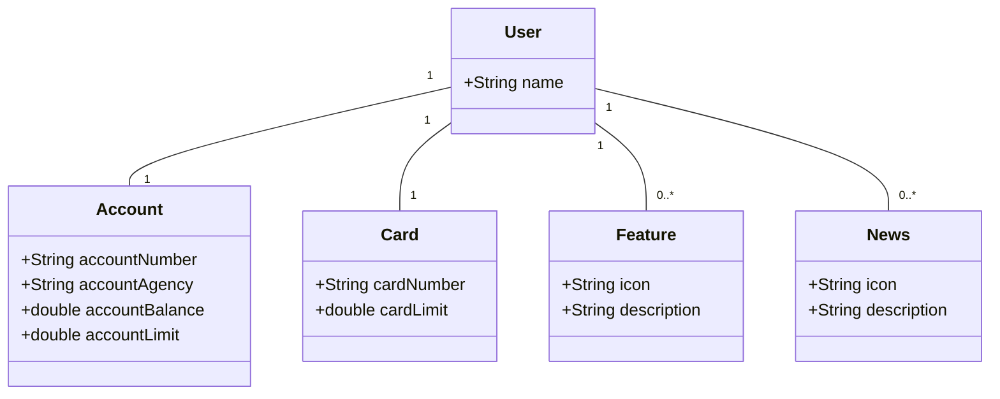

# Santander JAVA Back End 2025

```mermaid
  classDiagram
    class User {
        +String name
    }

    class Account {
        +String accountNumber
        +String accountAgency
        +double accountBalance
        +double accountLimit
    }

    class Feature {
        +String icon
        +String description
    }

    class Card {
        +String cardNumber
        +double cardLimit
    }

    class News {
        +String icon
        +String description
    }

    User "1" -- "1" Account
    User "1" -- "1" Card
    User "1" -- "0..*" Feature
    User "1" -- "0..*" News
```
